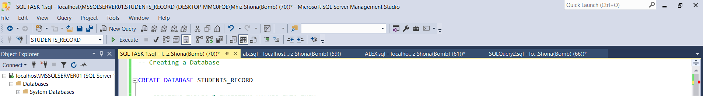

# Sql-fundamentals-Database-creation

This marks my intro into sql and my journey of becoming conversant with SQL terminologies and functions. I learnt database creation, tables creation and how to query data in a database.

_DISCLAIMER - The data used in this report does nit in any way represent any instituition or company, just a dummy dataset created by me for this purpose_

### TASKS TO BE CARRIED OUT

### ACTIONS PERFORMED

1. CREATE and USE DATEBASE
2. TABLE CREATION AND INSERTING VALUES INTO THE TABLES
3. ADDING PRIMARY AND FOREIGN KEYS TO THE TABLE
4. ADDING CONSTRAINTS **NOT NULL** TO THE ID COLUMN
5. CHANGED The COLUMN Name from Subject to COURSE
6. DROPPED The AGE COLUMN USING AGE USING

### FUNCTIONS

I Created my database and named it STUDENT_RECORD .

## CREATING TABLES AND INSERTING DATA WITHIN THE DATA BASE

### FIRST TABLE

DIMENSION TABLE
- CREATED A TABLE TITLED **STUDENTS_INFO**
- THE COLUMNS AND DATATYPES WERE SPECIFIED AS (Student_ID INT IDENTITY(1,1) not null PRIMARY KEY, Gender VARCHAR(50), Name VARCHAR(50), Age INT, 
Subject VARCHAR(50) not null);
- THE STUDENT_ID COLUMN WAS MADE A PRIMARY KEY TO PROVIDE UNIQUE IDENTITFICATION.
- _NOT NULL_ WAS ADDED TO THE STUDENT_ID TO PREVENT THE COLUMN FROM TAKING NULL VALUES.
- THEN VALUES WERE INSERTED INTO THE CREATED TABLE.

 ### SECOND TABLE

 DIMENSION TABLE
- CREATED A TABLE TITLED **HEALTH_RECORDS**
- THE COLUMNS AND DATATYPES WERE SPECIFIED AS (Health_ID int identity(1,2) Primary key not null, Blood_Group varchar(50), Height decimal(2,1), Weight decimal(3,1));
- THE HEALTH_ID ID COLUMN WAS MADE A PRIMARY KEY TO PROVIDE UNIQUE IDENTITFICATION.
- _NOT NULL_ WAS ADDED TO THE STUDENT ID TO PREVENT THE COLUMN FROM TAKING NULL VALUES.
- THEN VALUES WERE INSERTED INTO THE CREATED TABLE.

### THIRD TABLE

THIS IS A FACT TABLE
- CREATED A TABLE TITLED **PERFORMANCE**
- THE COLUMNS AND DATATYPES WERE SPECIFIED AS (STUDENT_ID INT not null, health_id int not null, Score DECIMAL(3,1), Grade DECIMAL(3,1), 
FOREIGN KEY(STUDENT_ID) REFERENCES  STUDENTS_INFO(STUDENT_ID) ,
FOREIGN KEY(HEALTH_ID) REFERENCES HEALTH_RECORDS(HEALTH_ID));
- THE HEALTH_ID  AND STUDENT_ID COLUMN WAS ADDED AS A FOREIGN KEY TO TO CREATE A RELATIONSHIP BETWEEN THE TABLES.
- _NOT NULL_ WAS ADDED TO THE STUDENT_ID AND HEALTH_ID TO PREVENT THE COLUMNS FROM TAKING NULL VALUES.
- THEN VALUES WERE INSERTED INTO THE CREATED TABLE.
### MAKING A COPY OF THE DATA

I- I MADE A COPY OF THE STUDENTS_INFO TABLE INTO STUDENTS_INFO2 BEFORE PROCEEDING TO ALTER THE TABLE.

## ALTERING AND RENAMING TABLES

### RENAMING         
BEFORE RENAMING                                                                                        ||                                                                                 AFTER RENAMING
                                                                                           ||                                                                                

- I RENAMED THE COLUMN 'SUBJECT' IN THE STUDENTS_INFO TABLE USING = EXEC sp_rename 'STUDENTS_INFO.SUBJECT', 'COURSE', 'COLUMN';
- THIS RENAMED THE COLUMN 'SUBJECT' TO 'COURSE';
-  I Used SELECT * FROM STUDENTS_INFO TO VIEW THE UPDATED TABLE.

### ALTERING TABLES

### RENAMING         
BEFORE DROPPING                                                                                        ||                                                                                AFTER DROPPING
                                                                                           ||                                                                                

- I ALTERED THE STUDENTS_INFO TABLE BY DROPPING THE AGE COLUMN USING = ALTER TABLE STUDENTS_INFO
DROP COLUMN AGE;
- THIS DROOPED THE AGE COLUMN
- I Used SELECT * FROM STUDENTS_INFO TO VIEW THE UPDATED TABLE.

## THOUGHTS

Compared to learning EXCEL , my SQL learning journey hasnt been as smooth, its an entire different ball game but an experience worth it, i have acquainted myself with sql basics and built a strong foundation on it, ranging from databse creation to adding tables and altering them, excited for the next chapter of my learning journey as i aim to learn more and become proficient with SQL and i hope you are too.
THANKS FOR HANGING AROUND
SEE YA. 😙😄

